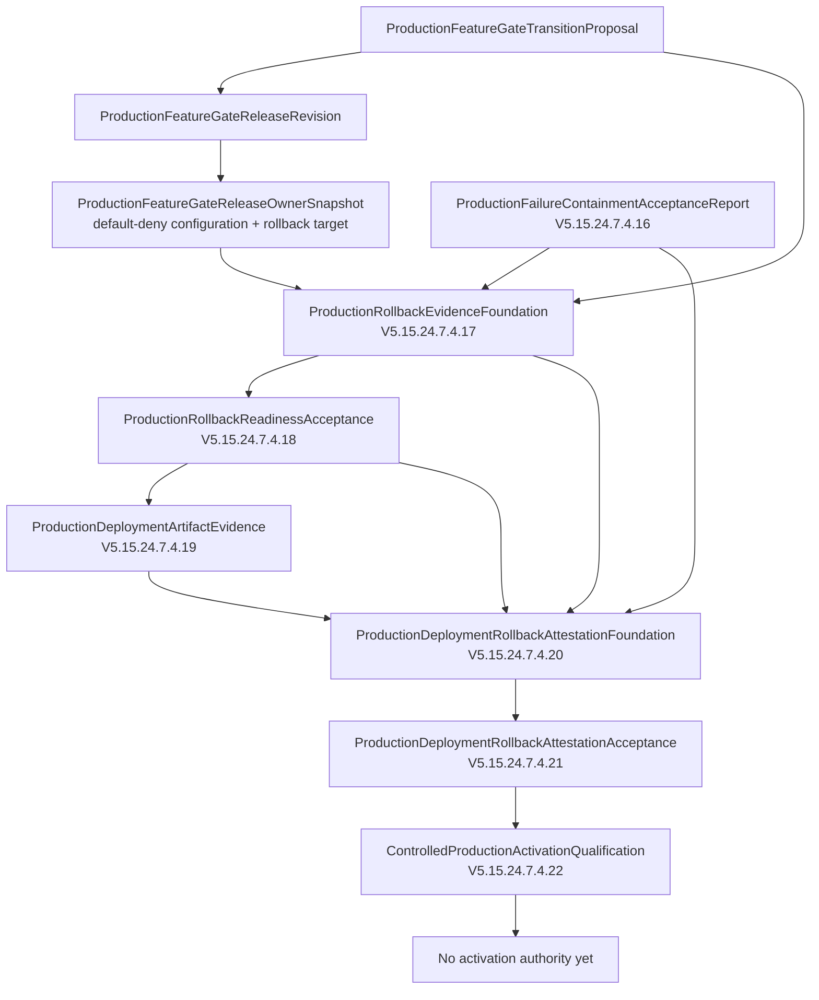
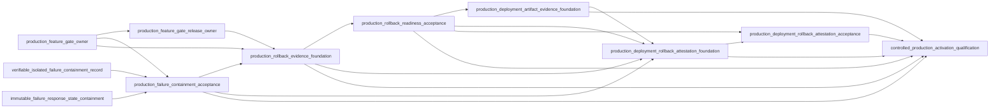
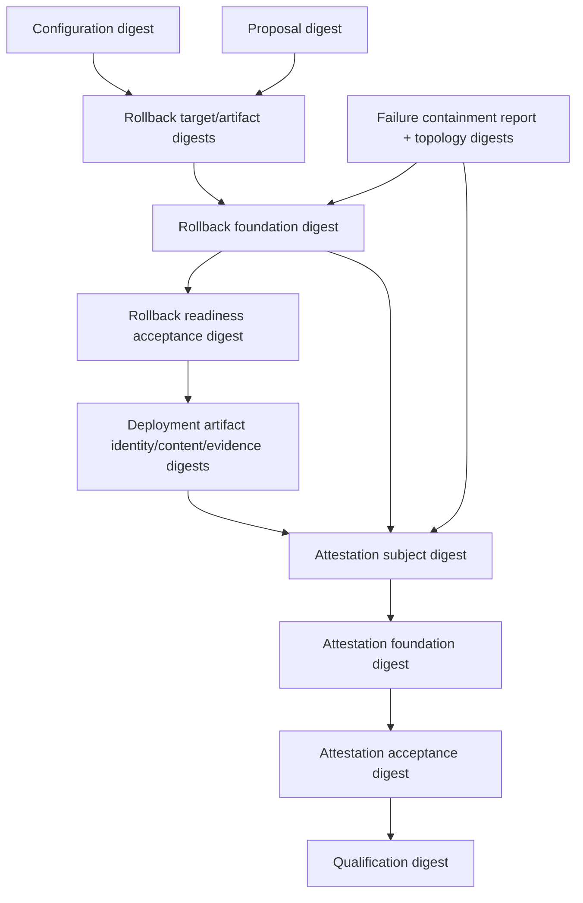
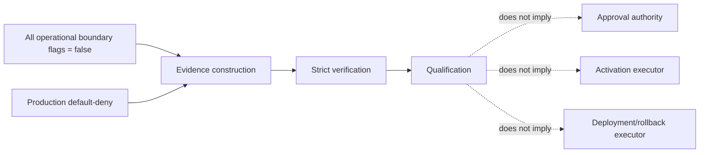
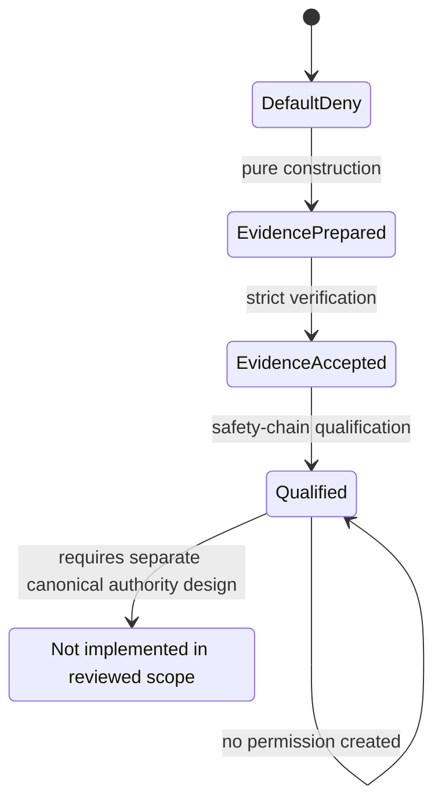

# Production Safety Chain Architecture Map

Baseline: `265b423dd32444d17d48a2a6ca084a2db8290b67`

## End-to-End Safety Chain

## Module Dependency Graph

No circular import was identified in the reviewed core chain. Dependencies point from downstream aggregation layers toward upstream evidence layers.

## Evidence and Digest Lineage

## Authority and Operational Boundary

## Qualification Versus Activation Boundary

## Node Reference

| Node | Status | Input | Output verifier | Operational boundary | Consumer |
|---|---|---|---|---|---|
| Failure containment | `PRODUCTION_FAILURE_CONTAINMENT_ACCEPTED` | batch + state binding | report verifier | no deployment/rollback authority | rollback foundation |
| Rollback evidence | `ROLLBACK_EVIDENCE_BOUND_NOT_ATTESTED` | owner + proposal + containment | foundation verifier | all authority false | readiness |
| Rollback readiness | `ROLLBACK_READINESS_ACCEPTED` | rollback foundation | acceptance verifier | no execution | deployment/attestation |
| Deployment artifact | `DEPLOYMENT_ARTIFACT_EVIDENCE_PREPARED` | readiness | evidence verifier | no deployment | attestation foundation |
| Attestation foundation | `DEPLOYMENT_ROLLBACK_ATTESTATION_PREPARED` | deployment + rollback + readiness + containment | foundation verifier | no successful attestation | acceptance |
| Attestation acceptance | `DEPLOYMENT_ROLLBACK_ATTESTATION_ACCEPTED` | prepared foundation | acceptance verifier | no operational attestation | qualification |
| Activation qualification | `CONTROLLED_PRODUCTION_ACTIVATION_QUALIFIED` | attestation acceptance | qualification verifier | no permission/activation | none |

